# Setup Tutorial
**For this tutorial, I will be walking you through how to set up a simple repository on your machine. This guide is an ongoing process and will be continously updated**

**DISCLAIMER**
- *This tutorial uses examples for **Windows 10**. These instructions may differ for **Linux** and **Mac OSX**.*

## Contents
1. [Install Git](#step-1-install-git)
    - A.  [Get Git](#1a-get-git)
    - B.  [Downloads](#1b-downloads)
    - C.  [Choose OS](#1c-choose-os)
    - D.  [Install](#1d-install)
    - E.  [Verify](#1e-verify)
2. [Create a Directory](#step-2-create-directory)
    - A.  [Create new folder](#2a-create-a-new-folder)
    - B.  [Open in Terminal](#2b-open-in-terminal)
3. [Create a Git Repository](#step-3-create-a-git-repository)

## Step 1: Install Git
If you have not already have Git installed on your machine, do that

### 1.A: Get Git
- you can find it [here](https://git-scm.com/)

### 1.B: Downloads
- Navigate to Downloads

    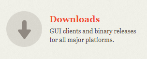

### 1.C: Choose OS
- Choose your OS and download

    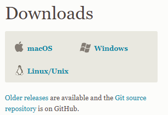

### 1.D: Install   
- Depending on your OS the installation may differ, just go with the defaults for now.

- You may have to keep clicking Next if this is your first time.

    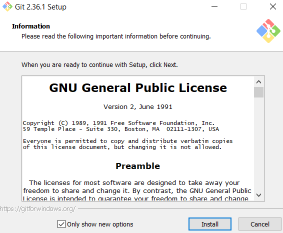

### 1.E: Verify
- After you have installed Git on your machine, type the following command into the terminal

    ```
        git --version
    ```

- If you get an error, git was not installed properly. Try again and verify with the terminal.

    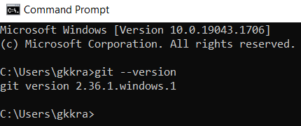

    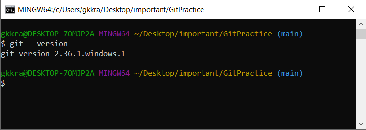

- Congrats, you now have Git installed on your machine.

## Step 2: Create Directory
### 2.A: Create a new folder
- You will now need a directory for git to track changes
    - NOTE: you may skip ahead to 2.B if you already have a directory
- This can be accomplished by creating a folder which will contain your work
- `Right-Click` -> `New` -> `Folder`

    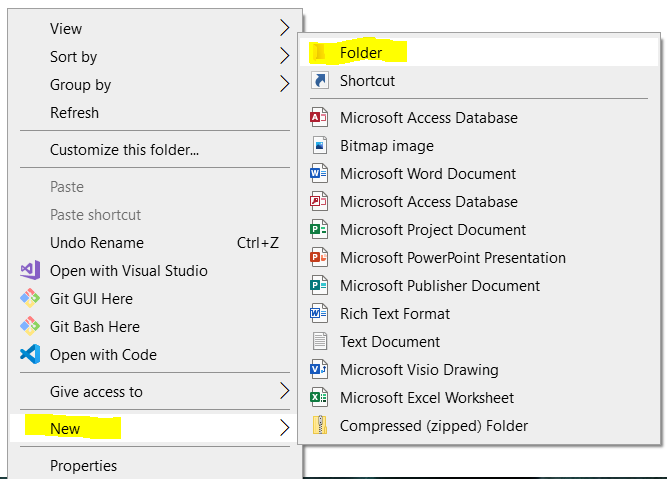

- Name your directory then open it

### 2.B: Open in Terminal
- Open the directory in the Terminal or navigate to it via the CLI
    - **NOTE: *if you have spaces in the folder and file names, you will need the path to be in "quotes"***

- The command to **Change Directory** is `cd`
    - **NOTE: *if you are unsure of the filepath, right-click inside your directory, choose properties and note the filepath. You will need to add the name of your new directory to the end of that filepath.***
    - `Right-click` -> `Properties`

    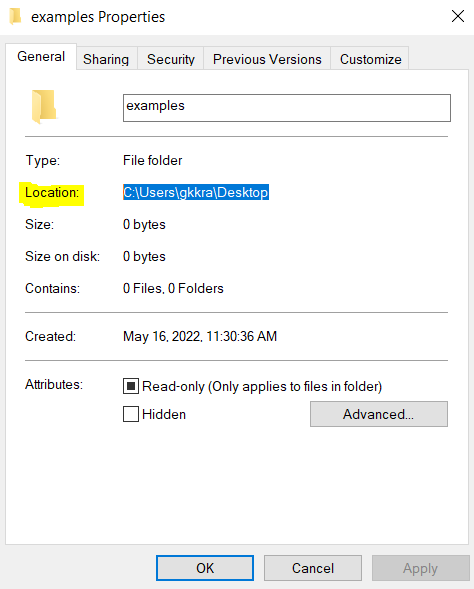

    - press `WinKey` + `R` to use Run command
        - type CMD and hit `Enter`

    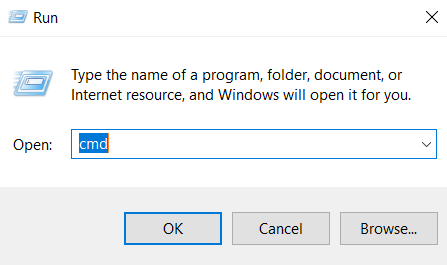

    - You can also use the Bash if you prefer

    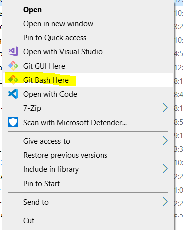

    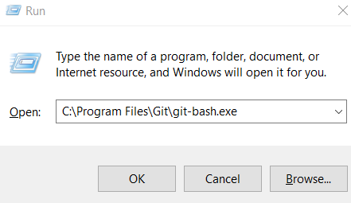

    - Type `cd <Filepath>` (works in Bash)

    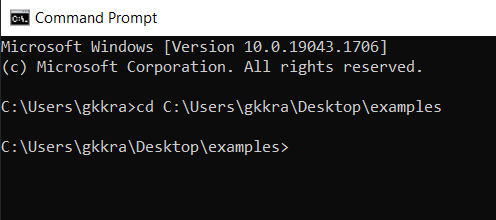

    - optionally you may use the `dir` command and navigate manually
    - `ls` for Bash

## Step 3: Create a Git Repository
- type the following command 
    ```
        git init
    ```

    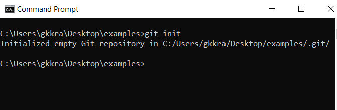


- optionally you can use Git Bash or Git GUI to create your repo.

    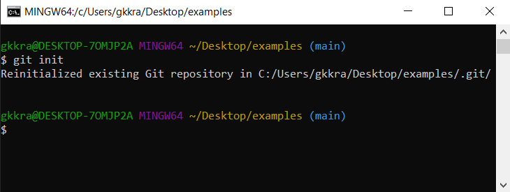

- in Windows Explorer, if you can view hidden folders and files, you may have noticed a new folder named .git

    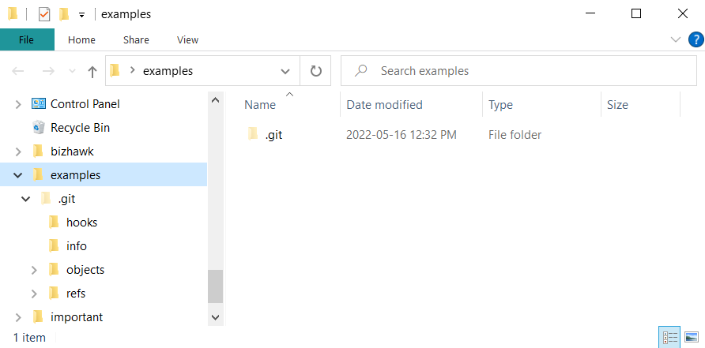

- Your new git repo has now been setup and will be able to keep track of any changes you make. In the next lesson I will demonstrate how to make use of your git repo