# Core Usage Tutorial
**For this tutorial, I will be walking you through the most common functionality of git. This guide is an ongoing process and will be continously updated**

**DISCLAIMER**
- *This tutorial uses examples for **Windows 10**. These instructions may differ for **Linux** and **Mac OSX**.*

## Contents
1. [Information Commands](#information-commands)
    - A.  [Git status](#a-git-status)
    - B.  [Git diff](#b-git-diff)
    - C.  [Git show](#c-git-show)
    - D.  [Git log](#d-git-log)
2. [Understanding the Trees](#understanding-the-trees)
    - A.  [Working Directory](#a-working-directory)
    - B.  [Staging Directory](#b-staging-directory)
    - C.  [Repository](#c-repository)
    
## Information Commands
- The following commands can tell you what the current state (or previous state) your repository is in.

### A. Git Status
- In your current git repo, typing `git status` will display what the current state is.

    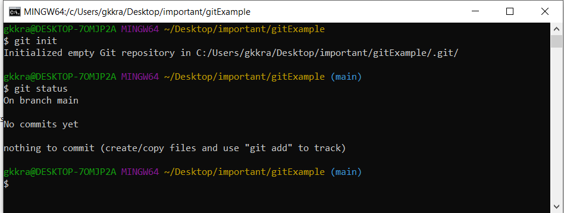

- This is only an empty directory, so nothing is being tracked right now.
- By adding files and then using `git status`, we now have ***untracked files***

    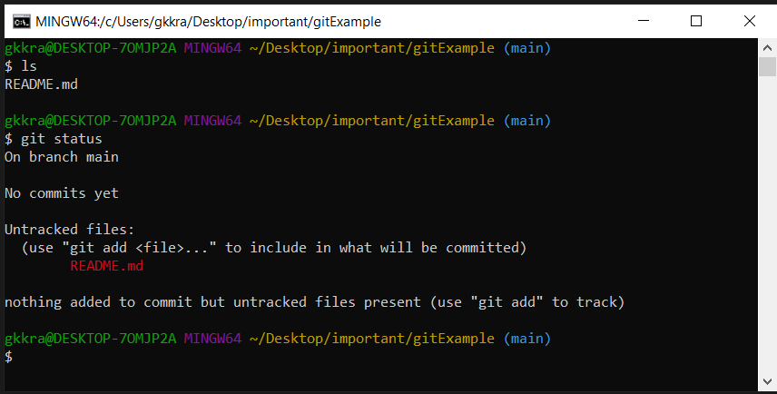

- This shows we have a README.md in our **Working Directory**, but it is not being tracked
- Since README.md is a good starting file, we should use `git add README.md` to begin tracking this file

    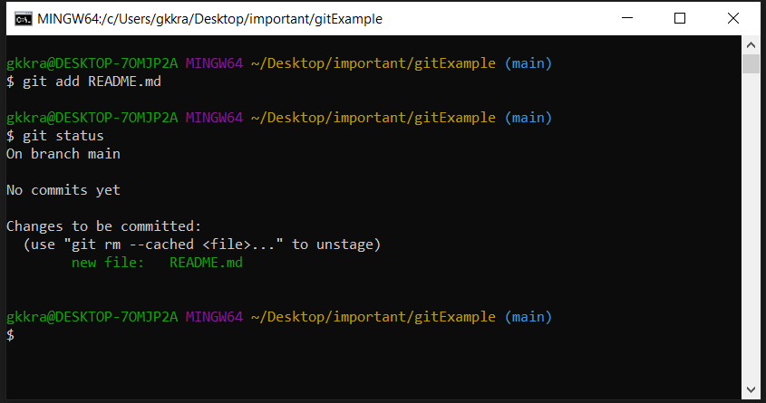

- README.md is now in the **Staging Index**, a directory which holds onto our changes before we commit them
- Now we will commit the file
    - NOTE: you ***must*** supply a commit message using the `-m` flag. 
        - Omitting this flag allows for a multiline comment 
        - Your text editor will open up a special file where you can enter in a multiline comment. 
        - When finished, save and exit and the commit will finish. 
        - Supplying an empty commit message will abort the commit.

    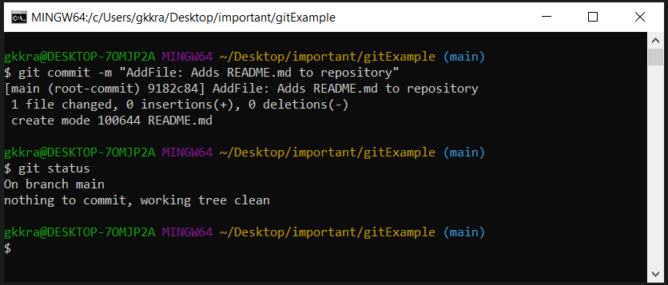

- `git status` now tells us that there is nothing to commit, and the working tree is clean.
    - NOTE: The working tree is where we actively make changes to our repository, but nothing is final here until will `git add <file>` the changes

- Lets add some content to the README.md...

    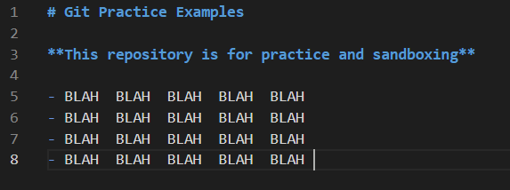

- use `git status`

    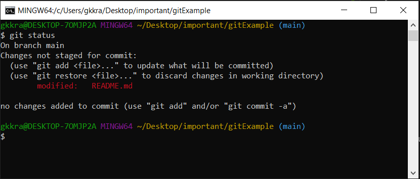

- Now status tells us that a **Tracked file** has been modified in our *Working Directory*
- If we are satisfied, we can now add it to the *staging directory*

    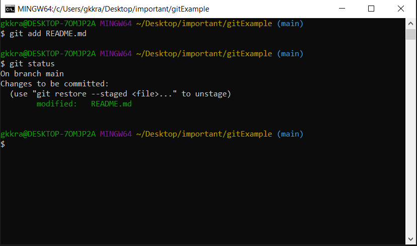

- and from here we can now commit our changes

    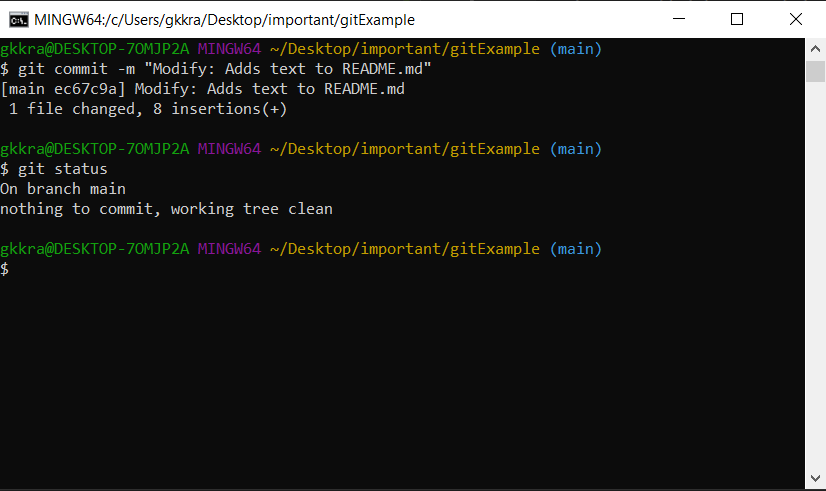

### B. Git Diff
- The Following Command will show you a comparrison between your working tree and a commit
- `git diff` - This will display the changes to unstaged files

    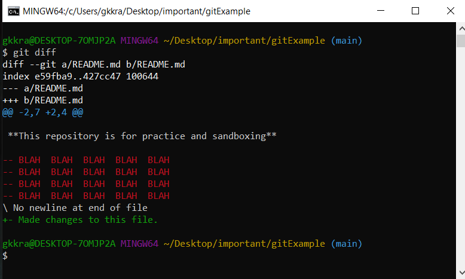
    - To exit the diff tool, press `q`.
    - To display a full page, press `z`.
    - To print next line press `Enter`.
- after adding using `git add <filename>`, the files will be *'staged'*

    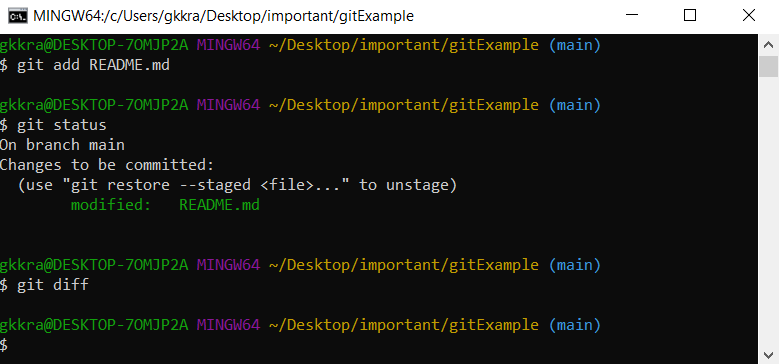

- the diff command no longer does anything

- `git diff --staged` - to view changes to staged files

    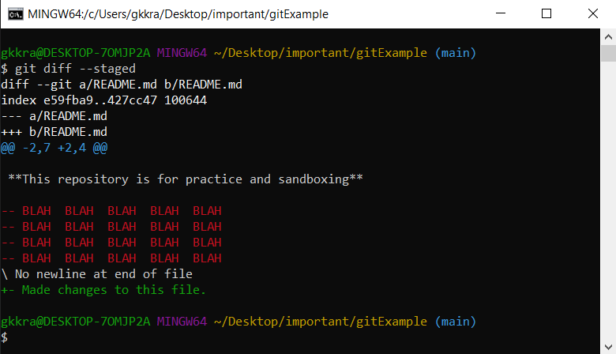

- `git diff <old commit SHA-1>..<new commit SHA-1>` - displays changes between 2 specified commits

    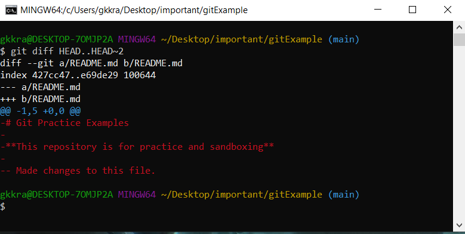
    - can use HEAD as argument, will use its SHA-1.
    - using `~n` where n is any number of parent levels to go back will replace with the argument with the necessary SHA-1 for that commit

### C. Git Show
- When we only want to view a single commits changes in isolation, we can use `git show`

- `git show <Sha-1>` shows all changes for the commit associated with the Sha-1.

    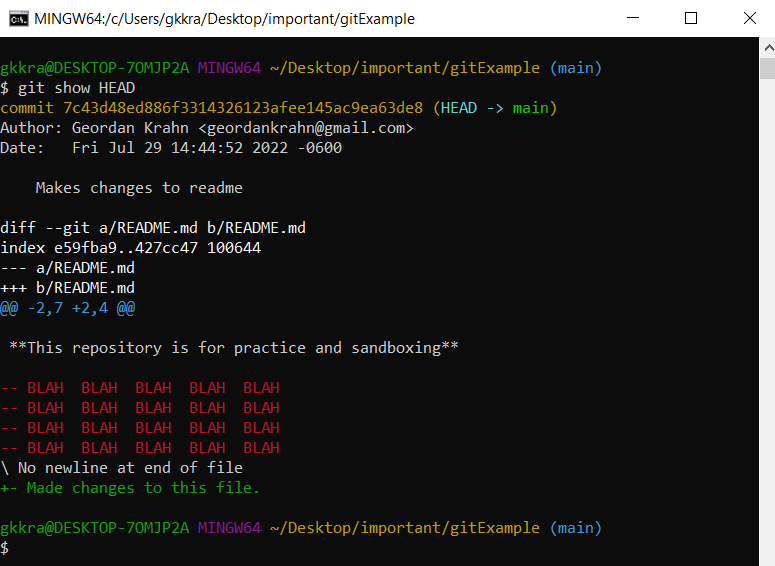
    - If the Sha-1 is unspecified, will use the current HEAD Sha-1.
    - Can use HEAD to specify SHA-1
        - ~n to go back n number of commits
        - ^ to go back a single commit
    - Like the Diff Tool, To exit, press `q`.
    - To display a full page, press `z`.
    - To print next line press `Enter`.
    
### D. Git Log
- `git log` - Displays information about the commit history

    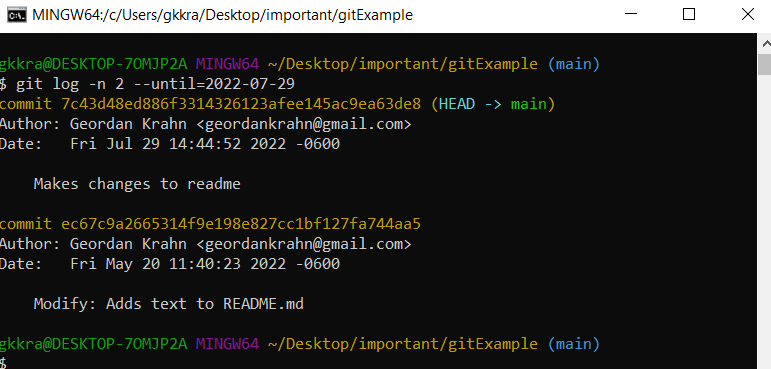

- `commit 708c6dac011fe676a480742a48f68278a0d22e1d (HEAD -> main)`
    - `Commit ID` is a SHA-1 Hash which identifies the commit

- Some important information associated with each commit:
    - `Author` - The user and email associated with the commit
    - `Date` - Date and time of the commit
    - `Commit message` (All commits must have one)

- We can specify which commits we want to see in the commit history, our log.

- Useful Flags:
    - `-n #` - limits how many results to return to the terminal
    - `-n 3` - will only display the 3 most recent commits
    - `--since=yyyy-mm-dd` - displays all commits going back to the date specified
    - `--until=yyyy-mm-dd` - displays all commits going to the date specified
    - `--author=<partialString>` - displays all commits from a specified author
    - `--grep=<regex>` - can use regular expressions specified as a string
- To exit the log before or when you reach the (END) statement you can press `q`.
- To display a full page of results at once, press `z`.
- To print the next line, press `Enter`.