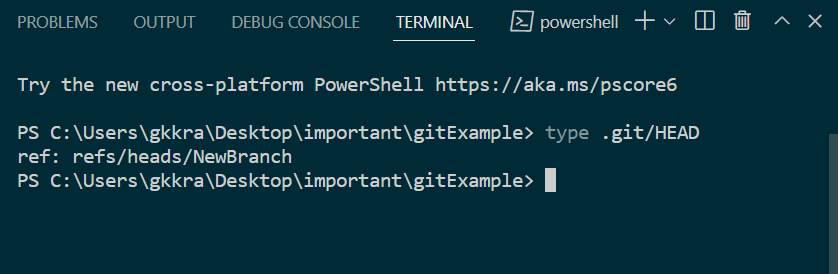

# Using Branches

## Contents
1. [Introduction](#introduction)
    - A. [Overview](#overview)
    - B. [View Branches](#view-branches)
2. [Using Branches](#using-branches-1)
    - A. [The Current Branch](#the-current-branch)
    - B. [Create New Branch](#create-new-branch)
    - C. [Switching Branches](#switching-branches)
    - D. [Comparing Branches](#comparing-branches)
    - E. [Renaming Branches](#renaming-branches)
    - F. [Deleting Branches](#deleting-branches)
    - G. [Resetting Branches](#resetting-branches)
3. [Merging](#merging)
    - A. [Merge](#merge)
    - B. [Conflicts](#conflicts)
    - C. [Resolving Conflicts](#resolving-conflicts)
4. [See Also](#see-also)

## Introduction

### Overview
When we make changes to our project, especially in a team, it becomes necessary to work on a set of changes in isolation, before adding those changes to the main branch.

- In Git, we start off with a **Main** branch.
- We can create branches off of the **Main**.

### View Branches
- To view the branches in your repo, use `git branch`

    
    - Here, **main** is the only branch
    - The current branch will be highlighted in green

## Using Branches

### The Current Branch
- In the image above, there is only one branch
- Remember our HEAD, When we make a commit to another branch the HEAD will point to the other branch instead of main. This would be the current branch. 
- We can switch branches. HEAD will point to the most recent commit in the current branch.

### Create New Branch
- use `git branch <branch name>` to create a new branch.

    
    - The branch name Cannot contain spaces.
    - The branch name Can contain letters, numbers and underscores.

- After creating the new branch, it will be listed in the branches when we use the `git branch` command

    
    - The branch *NewBranch* is listed
    - Notice that *main* is still the current branch

### Switching Branches
- use the `git checkout <branch name>` command to switch to another branch.

    
    - notice which branch we are on, see the blue text

- We can now confirm we are on the new branch

    
    - The current branch is highlighted in green

- The following commands allow us to see the contents of the HEAD file in the .git directory. This is useful if you want to know what the HEAD points to.

    - On Linux or BASH
    

    - On Windows
    

- ***Remember**, the HEAD always points to the most recent commit in a branch*

- Now that we are on the new branch, lets make some changes. I will create a folder with a single file, and edit a line in the README.md

    

- using `git status` we can see the staging directory only retains changes on the current branch

    

- Once committed, if we switch back to the main branch using `git chechout main`. Note the structure of the directory after we switch. This is because main has been untouched by the changes to the other branch.

    

- We can create a branch and switch to it by using the `-b` flag for the `git checkout` command.

    

- We do not need to be on main to create a new branch. A branch can be made anytime from the current branch. So if the current branch is called TestBranch and we create a new branch called NewTestBranch, it will be a branch of TestBranch.

- Suppose we make changes to the working directory on this new new branch. If we switch to main, those changes may be lost...

    
    - luckily git aborts this task. Go back to the other branch and add or discard those changes. Then you can safely return to the main branch.

**Rules When Switching Branches With Un-Commited Changes**
```
    1.  Switching Branches is not possible if changes to the current
        branch conflict with the destination branch.
    
    2.  Switching is permissible if changes in the working directory 
        will not conflict with the destination branch.

    3.  Switching is permissible for untracked files.
```

   - *If there are conflicts, there are a few options. You may `commit` the changes, `discard` the changes, or `stash` the changes.*


### Comparing Branches
- To compare a branch, just use `git diff <Branch name>..<Branch name>`

    

### Renaming Branches
- Use the `-m` flag of the `git branch` command to rename a branch
- `git branch -m <old branch> <new branch>`

    
    - Notice the new name in the blue text.
### Deleting Branches
- Maybe your changes wont be useful, or have too many conflicts to merge. Whatever the case, you this branch is no longer useful.

    

- Delete a branch by using `-d` flag for the `git branch` command.
- `git branch -d <Branch name>`

    
    ***NOTE:** YOU CANNOT DELETE THE **CURRENT BRANCH***
### Resetting Branches
- Resetting will change the state of the files in the staging index and working directory for the desired commit.
- This will move the HEAD to point to the desired commit.

**There are 3 types of reset:**
```
    Soft
    - Moves the HEAD to the desired commit
    - Does not affect the staging or working directories
    Mixed
    - If not option is specified, this is the default.
    - Moves the HEAD to the desired commit
    - Changes the staging directory 
    - not the working directory.
    Hard
    - Moves the HEAD to the desired commit
    - Changes both the staging and working directories
```
- `git reset --soft` - performs a soft reset
    - rolls back to an old state but working and staging directories keep changes.
    - This can be a useful way amend a series of previous commits
    - after the reset the previous commits will be gone.
- `git reset` and `git reset --mixed` - performs a mixed reset
    - This leaves the working directory unchanged.
    - Can be used to reorganize commits
- `git reset --hard` - performs a hard reset
    - Rolls back and deletes all changes.
    - permanently destroys commits.
- try to avoid resetting shared commits.
- Mixed and Hard can be destructive, so be careful.
- `git reset [--mixed|--soft|--hard] <tree-ish>`

    

## Merging

### Merge

### Conflicts

### Resolving Conflicts

## See Also
- **[Lesson 4: Working With Remotes](../Lesson4/Remotes.md)**
- **[Appendix](../Appendix/Appendix.md)**
- **[Main Menu](../README.md)**