# Working With Remotes
*So far we have been working with Local repositories. Remote repositories are hosted on a network. There are many repository hosting services available, such as github. You could also host your on git server.*

**For this tutorial i will be explaining how to set up and use remotes.**

**DISCLAIMER**
- *This tutorial uses examples for **Windows 10**. These instructions may differ for **Linux** and **Mac OSX**.*

- *Since this tutorial works with remotes, the examples will only use Visual Studio Code. This is to easily work with the Github repos without the need to supply credentials every time a push is made.*

## Contents

1. [Remotes](#remotes)
    - A. [Overview](#overview)
    - B. [Adding a Remote](#adding-a-remote)
    - C. [Creating Remote Branches](#creating-remote-branches)
    - D. [Cloning a Remote](#cloning-a-remote)
2. [Working With a Remote](#working-with-a-remote)
    - A. [Pushing & Pulling](#pushing--pulling)
    - B. [Merging](#merging)
    - C. [Checkout a Remote Branch](#checkout-a-remote-branch)
    - D. [Deleting Remote Branches](#deleting-remote-branches)
3. [Working With a Team](#working-with-a-team)
    - A. [How to Enable Collaboration](#how-to-enable-collaboration)
    - B. [What is Collaboration?](#what-is-collaboration)
4. [See Also](#see-also)

## Remotes

### Overview
- Remotes are repositories which are hosted over a network.
- They allow for collaboration with team members, either internally or externally (company intranet vs internet)
- We can link a local repository to remote, sync them, and push and pull changes between the local and remote repositories.
- A Quick inspection of the .git folder will reveal what is occuring with the remote repository

    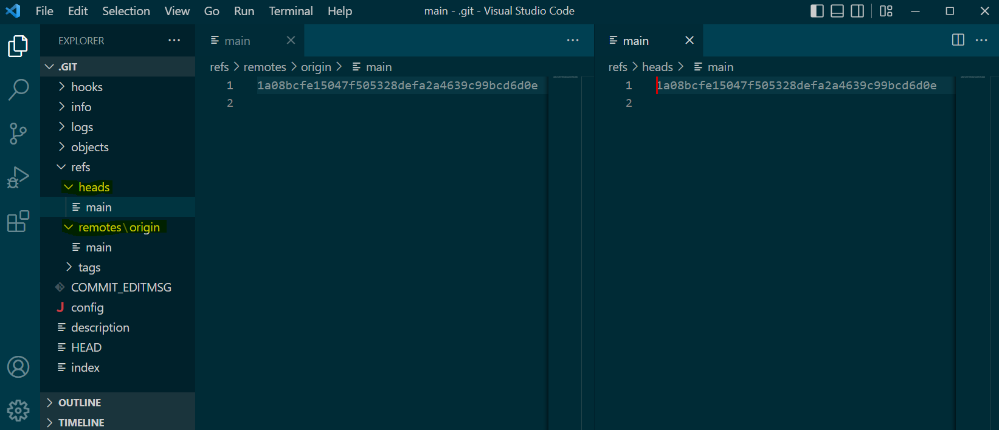
    - `heads` contains the all the local references
    - `remotes\origin` contains the remote references
    - git will try to keep these in sync

- When your local repository is ahead of your remote, push your changes. This will sync refs/heads and refs/remotes/origin.
- If your local repository is behind, you will need to pull changes.
* [Return To Top](#contents)
### Adding a Remote
- On github, click on your profile picture, then select `your repositories`. 

    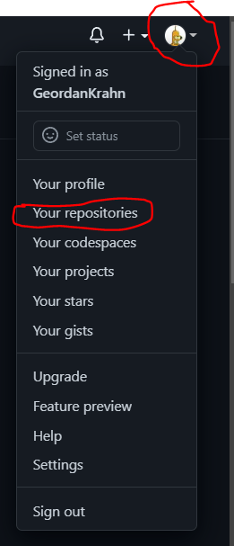

- Then click `new`

    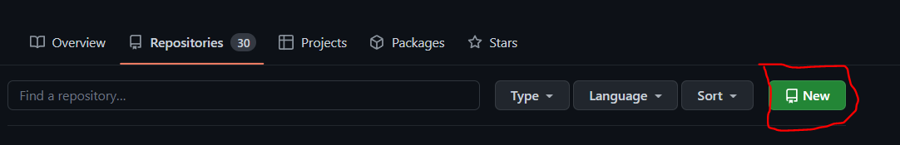

- Then create the repo, after choosing a name, etc...

    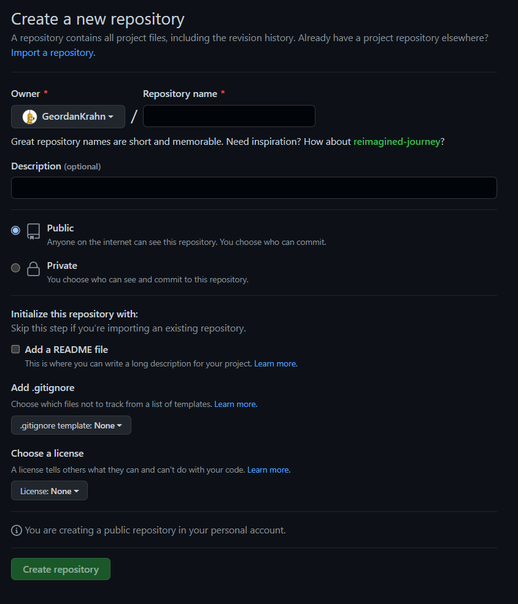
    - When you are done, click `Create Repository`

- Create an empty workspace and initialize the repository

    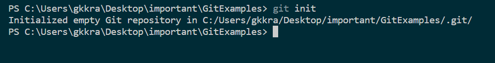

- Add a readme and then make your first commit.

    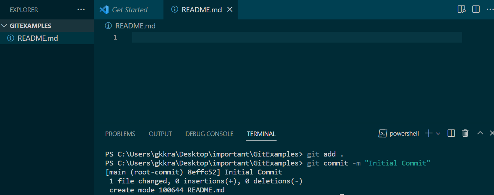

- use the `git branch -M main` command
    - the `-M` flag applies both `--force` and `--move` on the branch, which will move and reset the branch.

    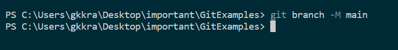

- Use `git remote add <Name> <URL>` to add a remote repository to your local repository.
    - The convention is to name the remote `origin`
    - The URL will be on Github.

- `https://github.com/<YOUR_ACCOUNT_NAME>/<PROJECT_NAME>`

    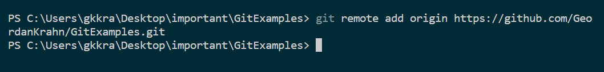
    - REMEMBER TO USE YOUR OWN ACCOUNT NAME!

- To remove a remote for any reason use `git remote rm <Name>`
* [Return To Top](#contents)
### Creating Remote Branches
- When the remote has been set up, you can select which branch should be tracked. The `-u` or `--set-upstream` flag will add tracking references on the remote repository. This shares the branch with others who can access the repository.
- Use `git push -u origin main` which will update remote references for your main branch.
- you may do this with other branches, provided the remote name and local name reflect this.

    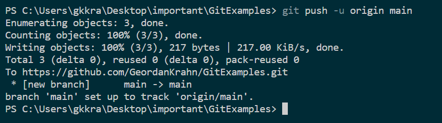
* [Return To Top](#contents)
### Cloning a Remote
- Cloning an existing remote is an easy way to set up a local repo for you to make changes.
- open up an empty workspace to clone the repository into.
- use `git clone <URL> <Name>` to clone the existing repo to your computer.
    - `<URL>` is the remote repository
    - `<Name>` the name of the cloned repository

    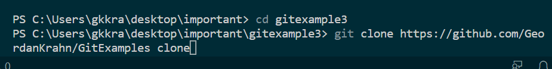

- After the clone, open up the repository

    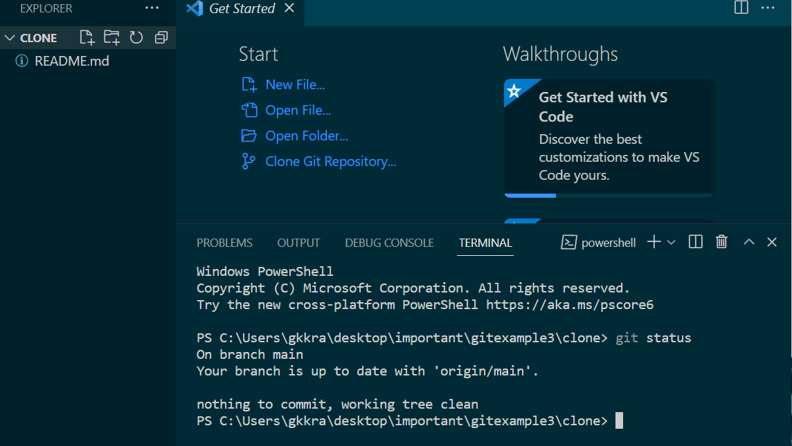
    - The cloned repository is up to date.
* [Return To Top](#contents)
## Working With a Remote

### Pushing & Pulling
- Use `git push` to push your changes to your remote.

    

* [Return To Top](#contents)
### Merging
* [Return To Top](#contents)
### Checkout a Remote Branch
* [Return To Top](#contents)
### Deleting Remote Branches
* [Return To Top](#contents)
## Working With a Team

### How to Enable Collaboration
* [Return To Top](#contents)
### What is Collaboration?
* [Return To Top](#contents)
## See Also
- **[Appendix](../Appendix/Appendix.md)**
- **[Main Menu](../README.md)**
* [Return To Top](#contents)