[<< Lesson3](../Lesson3/Branching.md) | **Lesson4** | [Appendix >>](../Appendix/Appendix.md)

# Working With Remotes
*So far we have been working with Local repositories. Remote repositories are hosted on a network. There are many repository hosting services available, such as github. You could also host your on git server.*

**For this tutorial i will be explaining how to set up and use remotes.**

**DISCLAIMER**
- *This tutorial uses examples for **Windows 10**. These instructions may differ for **Linux** and **Mac OSX**.*

- *Since this tutorial works with remotes, the examples will only use Visual Studio Code. This is to easily work with the Github repos without the need to supply credentials every time a push is made.*

## Contents

1. [Remotes](#remotes)
    - A. [Overview](#overview)
    - B. [Adding a Remote](#adding-a-remote)
    - C. [Creating Remote Branches](#creating-remote-branches)
    - D. [Cloning a Remote](#cloning-a-remote)
2. [Working With a Remote](#working-with-a-remote)
    - A. [Pushing & Pulling](#pushing--pulling)
    - B. [Fetching & Merging](#fetching--merging)
    - C. [Checkout a Remote Branch](#checkout-a-remote-branch)
    - D. [Deleting Remote Branches](#deleting-remote-branches)
3. [Working With a Team](#working-with-a-team)
    - A. [How to Enable Collaboration](#how-to-enable-collaboration)
4. [See Also](#see-also)

## Remotes

### Overview
- Remotes are repositories which are hosted over a network.
- They allow for collaboration with team members, either internally or externally (company intranet vs internet)
- We can link a local repository to remote, sync them, and push and pull changes between the local and remote repositories.
- A Quick inspection of the .git folder will reveal what is occuring with the remote repository

    
    - `heads` contains the all the local references
    - `remotes\origin` contains the remote references
    - git will try to keep these in sync

- When your local repository is ahead of your remote, push your changes. This will sync refs/heads and refs/remotes/origin.
- If your local repository is behind, you will need to pull changes.
* [Return To Top](#contents)
### Adding a Remote
- On github, click on your profile picture, then select `your repositories`. 

    

- Then click `new`

    

- Then create the repo, after choosing a name, etc...

    
    - When you are done, click `Create Repository`

- Create an empty workspace and initialize the repository

    

- Add a readme and then make your first commit.

    

- use the `git branch -M main` command
    - the `-M` flag applies both `--force` and `--move` on the branch, which will move and reset the branch.

    

- Use `git remote add <Name> <URL>` to add a remote repository to your local repository.
    - The convention is to name the remote `origin`
    - The URL will be on Github.

- `https://github.com/<YOUR_ACCOUNT_NAME>/<PROJECT_NAME>`

    
    - REMEMBER TO USE YOUR OWN ACCOUNT NAME!

- To remove a remote for any reason use `git remote rm <Name>`
* [Return To Top](#contents)
### Creating Remote Branches
- When the remote has been set up, you can select which branch should be tracked. The `-u` or `--set-upstream` flag will add tracking references on the remote repository. This shares the branch with others who can access the repository.
- Use `git push -u origin main` which will update remote references for your main branch.
- you may do this with other branches, provided the remote name and local name reflect this.

    
* [Return To Top](#contents)
### Cloning a Remote
- Cloning an existing remote is an easy way to set up a local repo for you to make changes.
- open up an empty workspace to clone the repository into.
- use `git clone <URL> <Name>` to clone the existing repo to your computer.
    - `<URL>` is the remote repository
    - `<Name>` the name of the cloned repository

    

- After the clone, open up the repository

    
    - The cloned repository is up to date.
* [Return To Top](#contents)
## Working With a Remote

### Pushing & Pulling
- Use `git push` to push your changes to your remote.

    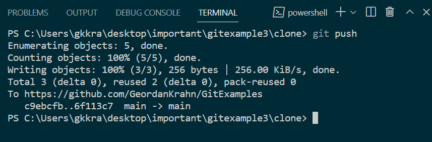

- Use `git pull` to sync with the remote.

    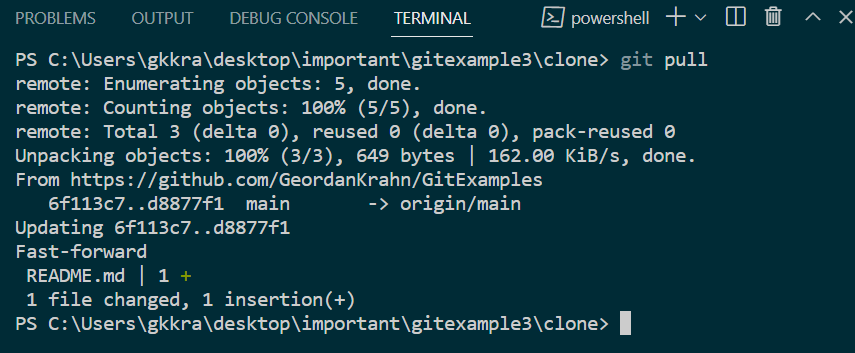

* [Return To Top](#contents)
### Fetching & Merging
- There is another way to update the local repository. The `git fetch` command is similar to pull, but it does not automatically integrate the changes into the local repository. They need to be merged in manually.

    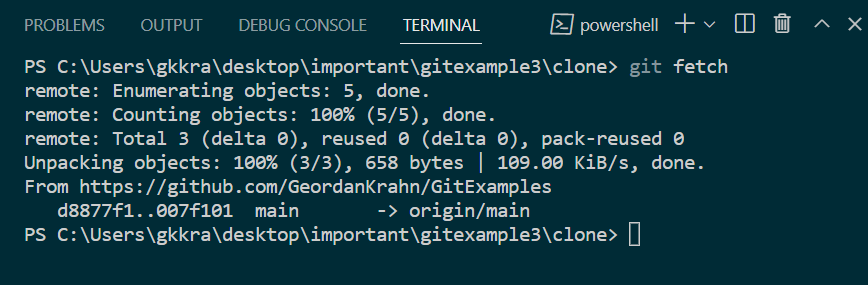

- After the fetch, the HEAD for the origin/main will be updated, but the local main will not be updated.
- Use `git merge origin/main` to merge in the changes. Resolve any conflicts.

    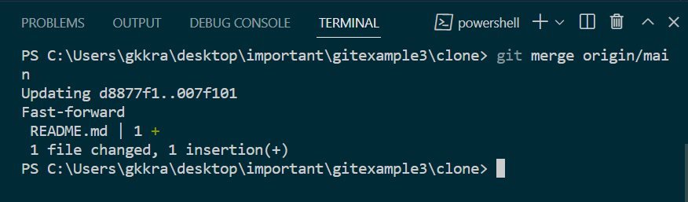

- If you are in a situation where the remote is ahead, and you have changes you want to push, you will be unable to push.
- To ensure that you can, perform the following steps:

    1.  `pull` or `fetch` the remote changes. `fetch` is safer here.
    2.  Resolve any potential conflicts before merging in remote changes.
    3.  `merge` in changes
    4.  `push` the new changes.

* [Return To Top](#contents)
### Checkout a Remote Branch
- If there are additional remote branches, you will need to set up tracking on them.

    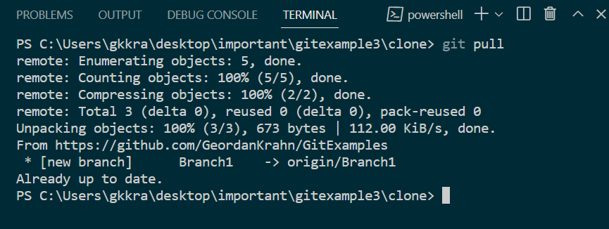

- Using `git branch` we can see that we are not tracking the other branch.

    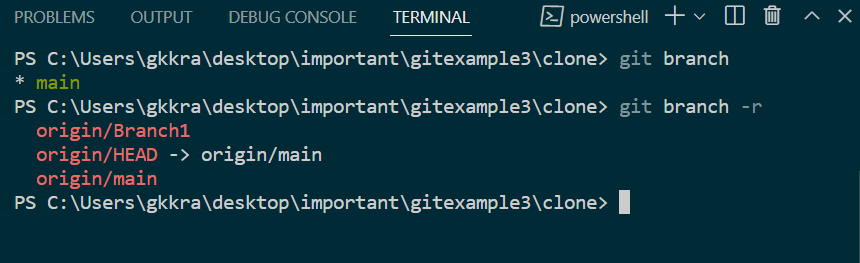
    - the `-r` flag shows the remote branches

- Use `git branch <Name> <Branch>` to set up local tracking for the remote branch. `<Branch>` is the remote branch you want to track, and `<Name>` will be its local name.

    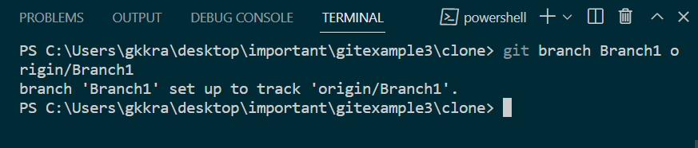

- Now when we look at our branches we can see the local changes reflected.

    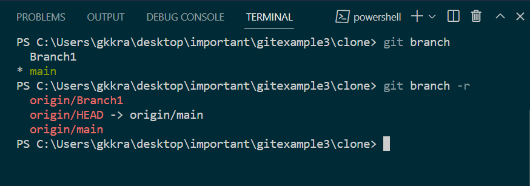

- You can now checkout the branch and push and pull from the remote branch.

* [Return To Top](#contents)
### Deleting Remote Branches
- use `git push <Remote> :<Branch>` to delete a remote branch.

    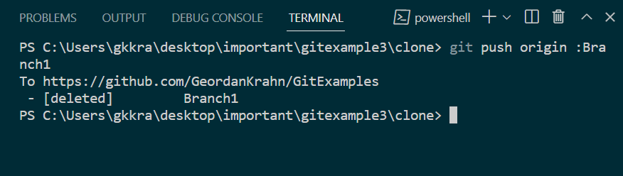

- The local branch remains however...

    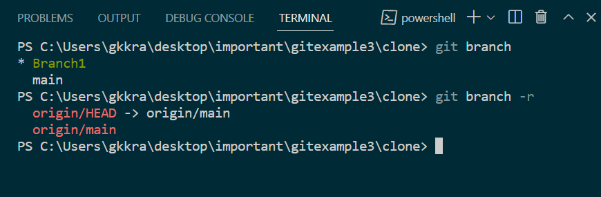
    - You will need to delete the local branch when you are done merging. 
    - `git branch -d <Branch>`

* [Return To Top](#contents)
## Working With a Team

### How to Enable Collaboration
- If you have a public or open source project which you would like to open up to collaboration, or a private project only a few trusted people can work on, you can enable collaboration on Github easily.

- First, make sure you are signed into your Github account.

- On your repos github page, click on `Settings`

    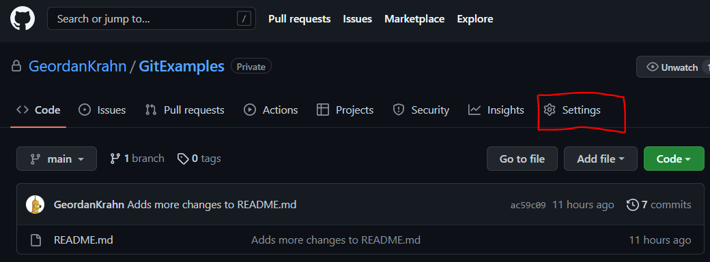

- Next click on `Collaborators`

    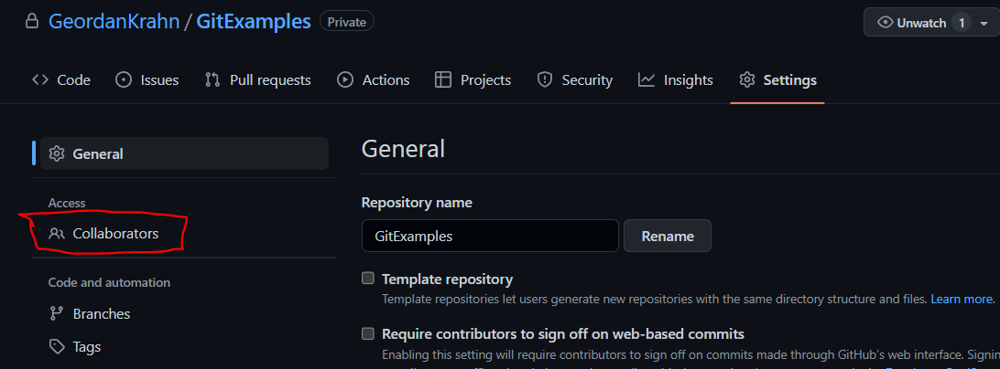

- You will be asked to enter your password
- Next, click on `Add People` in the Manage Access section

    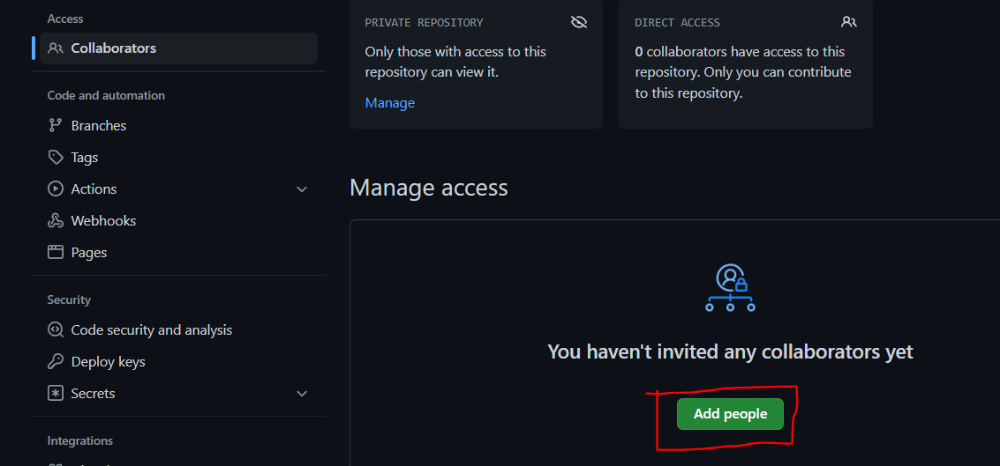

- Enter the `Email`, `Username`, or `Full Name` of the collaborator

    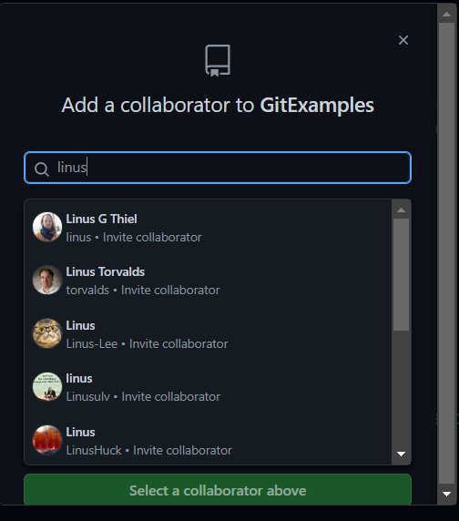
    - After clicking on the collaborator, click `add`.

- After that, Github will send an email to the Collaborator to confirm the invitation.

* [Return To Top](#contents)

**What is Collaboration?**
- As teams will differ from project to project, the workflow will also be differ. 
- Collaboration is different depending on the project, the team, project leader, etc...

* [Return To Top](#contents)
## See Also
- **[Appendix](../Appendix/Appendix.md)**
- **[Main Menu](../README.md)**
* [Return To Top](#contents)