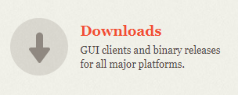
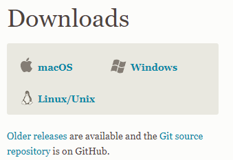
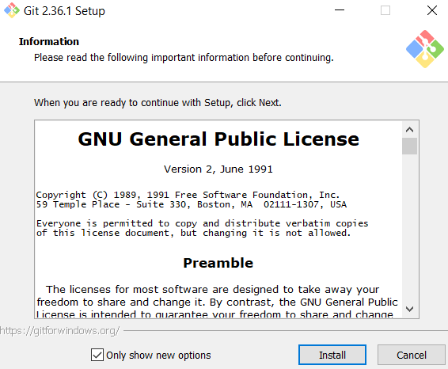
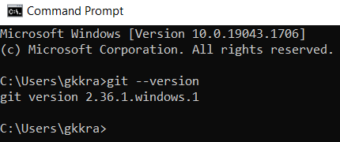

# Tutorial
**For this tutorial, I will be walking you through how to set up a simple repository on your machine, making changes to your directory, rolling back to a previous version, and more. This guide is an ongoing process and will be continously updated**

**DISCLAIMER**
- *This tutorial uses examples for **Windows 10**. These instructions may differ for **Linux** and **Mac OSX**.*

## Contents
1. [Install Git](#step-1)
2. [Create Directory](#step-2)

## Step 1
If you have not already installed Git on your machine, do that
- you can find it [here](https://git-scm.com/)
- Navigate to Downloads

    

- Choose your OS and download

    

- depending on your OS the installation may differ, just go with the defaults for now.
- You may have to keep clicking Next if this is your first time.

    

- After you have installed Git on your machine, type the following command into the terminal
    ```
        git --version
    ```
- If you get an error, git was not installed properly. Try again and verify with the terminal.

    

- Congrats, you now have Git installed on your machine.
## Step 2
